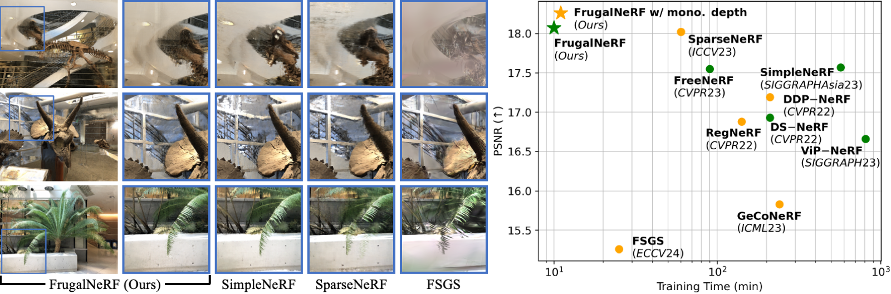

# FrugalNeRF

## [Project page](https://linjohnss.github.io/frugalnerf/) | [Paper](https://arxiv.org/abs/2410.16271)

This repository contains a pytorch implementation for the paper: [FrugalNeRF: Fast Convergence for Extreme Few-shot Novel View Synthesis without Learned Priors](https://linjohnss.github.io/frugalnerf/). Our work presents a simple baseline to reconstruct radiance fields in few-shot setting, which achieves **fast** training process without learned proirs.<br><br>

# FrugalNeRF

Project page: https://linjohnss.github.io/frugalnerf/ | Paper: https://arxiv.org/abs/2410.16271

Ngắn gọn: repo này chứa implementation PyTorch cho FrugalNeRF — một phương pháp NeRF tối ưu cho few-shot novel view synthesis với thời gian hội tụ nhanh.



---

## Nội dung file README (tóm tắt)

- Giới thiệu dự án và mục tiêu
- Hướng dẫn cài đặt môi trường (local & Kaggle)
- Danh sách datasets (bao gồm các link Kaggle bạn cung cấp)
- Quick start: train / render
- MapReduce component (build & run)
- Hướng dẫn demo tiền xử lý & lưu trữ dữ liệu

---

## Datasets (Kaggle links)

Bạn đã cung cấp các dataset sau — tôi liệt kê sẵn để tiện tải về và sử dụng trong project:

- Testing (small/sample): https://www.kaggle.com/datasets/thnhdg/testing (slug: `thnhdg/testing`)
- LLFF dataset (full): https://www.kaggle.com/datasets/arenagrenade/llff-dataset-full (slug: `arenagrenade/llff-dataset-full`)
- DTU dataset (mirror): https://www.kaggle.com/datasets/haihoan2874/dtu-dataset (slug: `haihoan2874/dtu-dataset`)

Tải bằng Kaggle CLI (PowerShell example):

```powershell
# Authenticate first: https://www.kaggle.com/docs/api
kaggle datasets download -d thnhdg/testing -p ./data --unzip
kaggle datasets download -d arenagrenade/llff-dataset-full -p ./data --unzip
kaggle datasets download -d haihoan2874/dtu-dataset -p ./data --unzip
```

Gợi ý:

- Lưu raw images vào `data/raw/<dataset_name>`
- Chuẩn hóa cấu trúc theo `data/nerf_llff_data/<scene_name>` nếu bạn muốn dùng configs có sẵn

---

## Installation (Local / Windows PowerShell)

Thử nghiệm trên Linux; trên Windows PowerShell cũng tương tự nếu cài sẵn Python/conda.

1. Tạo môi trường (ví dụ conda):

```powershell
conda create -n frugalnerf python=3.8 -y
conda activate frugalnerf
pip install --upgrade pip
```

2. Cài dependencies chính (CPU/GPU tuỳ máy):

```powershell
pip install torch torchvision --index-url https://download.pytorch.org/whl/cu118
pip install tqdm scikit-image opencv-python configargparse lpips imageio-ffmpeg kornia tensorboard torchmetrics plyfile pandas timm
pip install torch-efficient-distloss
```

Lưu ý: trên Kaggle/Colab thường đã có sẵn một số package (torch, torchvision). Nếu cần Colmap cho việc estimate poses, cài Colmap trên Linux.

---

## Quick start — Train & Render

Ví dụ train single scene (PowerShell):

```powershell
python train.py --config configs/llff_default_2v.txt --datadir .\data\nerf_llff_data\horns --train_frame_num 20 42 --test_frame_num 0 8 16 24 32 40 48 56
```

Một số scripts mẫu có trong `scripts/` để chạy trên Linux. Trên Windows bạn có thể chạy từng lệnh Python tương tự.

Render từ checkpoint:

```powershell
python train.py --config configs/llff_default_2v.txt --ckpt path\to\checkpoint --render_only 1 --render_test 1
```

---

## MapReduce Image Processing (overview)

Ở thư mục `mapreduce-image/` có một ứng dụng Java MapReduce (Hadoop) dùng để tiền xử lý tập lớn ảnh:

- Mục đích: image conversion, depth estimation, pose processing, ray generation, metadata parsing.
- Input: thư mục ảnh (và có thể kèm file `poses_bounds.txt` nếu có sẵn poses)
- Output: shard files (npy/npz/json) chứa rays, rgb, depth, metadata — sẵn cho training.

Build & chạy MapReduce (trên hệ thống có Maven & Hadoop):

```powershell
cd ..\mapreduce-image
mvn clean package
# Trên cluster Hadoop (example):
hadoop jar target/mapreduce-image-1.0-SNAPSHOT.jar org.mapreduce.Main hdfs_input_path hdfs_output_path
```

Nếu bạn không có Hadoop, tôi khuyên tạo một prototype Python local (tôi có thể tạo file `extra/demo_mapreduce.py`) để mô phỏng mapper/shuffle/reducer flow — đủ cho demo trình bày.

---

## Demo tiền xử lý (local prototype)

Gợi ý script (mô tả): `extra/demo_mapreduce.py` sẽ:

- Đọc một số ảnh trong `assets/` hoặc `data/raw/...`
- Dùng camera intrinsics giả định để compute per-pixel rays (origin, direction)
- Sample một số rays / pixel chunks, ghi ra `processed_demo/rays_shard_000.npy`, `processed_demo/rgb_shard_000.npy` và `processed_demo/metadata.json`

Bạn có thể chạy demo (khi script có sẵn) bằng:

```powershell
python extra\demo_mapreduce.py --input_dir data\raw\your_scene --out_dir processed_demo --shard_size 100000
```

---

## Training on Kaggle (short recipe)

Trong notebook Kaggle, bạn có thể clone repo and copy dataset into working folder. Example cells (Kaggle notebook):

```bash
!git clone https://github.com/haihoan2874/FrugalNerf.git
%cd FrugalNerf/FrugalNeRF
!pip install -r requirements.txt  # if created
# If dataset uploaded as input dataset, copy it
!cp -r /kaggle/input/llff-dataset-full ./data
!python train.py --config configs/llff_default_2v.txt --datadir ./data/nerf_llff_data/room --batch_size 4096 --train_frame_num 0 1 4 10 --n_iters 2000
```

Note: On Kaggle, install of system packages like `colmap` may not be allowed; use precomputed poses if possible.

---

## Recommended data layout (processed output)

```
processed_dataset/
  ├─ rays_shard_000.npy      # (M,3)
  ├─ rays_dir_shard_000.npy  # (M,3)
  ├─ rgb_shard_000.npy       # (M,3)
  ├─ depth_shard_000.npy     # (M,1)  (optional)
  └─ metadata_shard_000.json # camera params, mapping index->image
```

Shard size recommendation: ~100MB-1GB per shard (tune by available memory and I/O performance).

---

## Notes on storage & metadata

- Use HDFS or S3 for large-scale dataset storage (replication, throughput). For local demo keep data under `data/`.
- Store metadata (camera intrinsics/extrinsics, scene bounds) as JSON per-shard. Use MongoDB if you need flexible queries per-image.

---

## Contributing / Commit & Push

Sau khi bạn chỉnh sửa README hoặc thêm demo script, commit & push:

```powershell
git add .
git commit -m "Update README: add Kaggle dataset links and usage instructions"
git push origin main
```

Nếu bạn muốn, tôi có thể tạo file `extra/demo_mapreduce.py` và `notebooks/train_demo.ipynb` rồi cập nhật README tương ứng — chọn Yes để tôi tiếp tục.

---

## Citation

```
@inproceedings{lin2024frugalnerf,
  title={FrugalNeRF: Fast Convergence for Few-shot Novel View Synthesis without Learned Priors},
  author={Chin-Yang Lin and Chung-Ho Wu and Chang-Han Yeh and Shih-Han Yen and Cheng Sun and Yu-Lun Liu},
  booktitle={CVPR},
  year={2025}
}
```

## Acknowledgements

Code licensed under MIT. This repo draws ideas and code from TensoRF and ViP-NeRF. See licenses/ for details.
