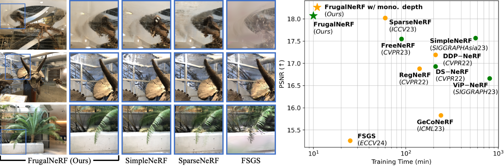

# FrugalNeRF

## [Project page](https://linjohnss.github.io/frugalnerf/) | [Paper](https://arxiv.org/abs/2410.16271)

This repository contains a pytorch implementation for the paper: [FrugalNeRF: Fast Convergence for Extreme Few-shot Novel View Synthesis without Learned Priors](https://linjohnss.github.io/frugalnerf/). Our work presents a simple baseline to reconstruct radiance fields in few-shot setting, which achieves **fast** training process without learned priors.<br><br>



## System Requirements

- OS: Windows 10/11 or Ubuntu 20.04+
- GPU: NVIDIA GPU with CUDA support (tested on RTX 3060 and above)
- RAM: 16GB minimum, 32GB recommended
- Storage: At least 10GB free space for datasets and model checkpoints

## Installation

### 1. Install CUDA and Python Dependencies

1. Install [CUDA Toolkit](https://developer.nvidia.com/cuda-downloads) (11.3 or higher)
2. Install [Conda](https://docs.conda.io/en/latest/miniconda.html)

### 2. Create and Setup Environment

```bash
# Create conda environment
conda create -n frugalnerf python=3.8
conda activate frugalnerf

# Install PyTorch with CUDA support (adjust cuda version as needed)
pip install torch torchvision --index-url https://download.pytorch.org/whl/cu118

# Install required packages
pip install tqdm scikit-image opencv-python configargparse lpips imageio-ffmpeg
pip install kornia tensorboard torchmetrics plyfile pandas timm
pip install torch-efficient-distloss

# Install COLMAP (required for dataset processing)
# For Windows: Download and install from https://github.com/colmap/colmap/releases
# For Ubuntu: sudo apt-get install colmap
```

### 3. Verify Installation

```bash
# Check CUDA is available
python -c "import torch; print('CUDA available:', torch.cuda.is_available())"
```

## Dataset Setup

### 1. Download Datasets

- **LLFF Dataset**:

  ```bash
  # Create data directory
  mkdir -p data/nerf_llff_data
  cd data/nerf_llff_data

  # Download and extract LLFF dataset
  # Option 1: Download from original source
  wget https://drive.google.com/drive/folders/14boI-o5hGO9srnWaaogTU5_ji7wkX2S7

  # Option 2: Or download individual scenes
  # fern, flower, fortress, horns, leaves, orchids, room, trex
  ```

- **Directory Structure**:
  ```
  data/
  └── nerf_llff_data/
      ├── fern/
      │   ├── images/
      │   └── poses_bounds.npy
      ├── flower/
      ├── horns/
      └── ...
  ```

### 2. Dataset Preprocessing (Optional for better quality)

```bash
# Generate sparse depth for LLFF dataset (if needed)
python extra/colmap_llff.py --data_dir ./data/nerf_llff_data/horns

# Verify dataset structure
python -c "from dataLoader.llff import LLFFDataset; ds=LLFFDataset('./data/nerf_llff_data/horns')"
```

## Quick Start

### Basic Training

1. **Quick Test** (Lightweight Version - Fast but Lower Quality):

```bash
# Train on horns scene with minimal settings
python train.py --config configs/llff_light_2v.txt --datadir ./data/nerf_llff_data/horns --train_frame_num 0 3 --test_frame_num 6
```

2. **Standard Training** (Better Quality):

```bash
# Train with default settings
python train.py --config configs/llff_default_2v.txt --datadir ./data/nerf_llff_data/horns --train_frame_num 0 3 --test_frame_num 6
```

3. **Full Training** (Best Quality):

```bash
# Train with more views
python train.py --config configs/llff_default_2v.txt --datadir ./data/nerf_llff_data/horns --train_frame_num 20 42 --test_frame_num 0 8 16 24 32 40 48 56
```

### Configuration Options

Key parameters in config files:

```bash
# Performance vs Quality trade-offs
downsample_train = 8.0     # Higher = faster but lower quality (4.0-8.0)
n_iters = 3000            # Number of training iterations
batch_size = 2048         # Reduce if running out of memory
N_voxel_init = 131072     # Initial voxel grid size (32^3)
N_voxel_final = 32768000  # Final voxel grid size (320^3)
```

## Rendering

### 1. Render Test Views

```bash
# Render test views from trained model
python train.py --config configs/llff_light_2v.txt --render_test 1
```

### 2. Render All Views

```bash
# Render test, train and path views
python train.py --config configs/llff_light_2v.txt --render_test 1 --render_train 1 --render_path 1
```

The rendering results will be saved in:

- Test views: `./log/<expname>/imgs_test_all/`
- Train views: `./log/<expname>/imgs_train_all/`
- Path views: `./log/<expname>/imgs_path/`
- Videos: `./log/<expname>/imgs_path/rgb.mp4`

## Troubleshooting

1. **CUDA Out of Memory**:

   - Reduce `batch_size` in config file
   - Increase `downsample_train`
   - Reduce `N_voxel_final`

2. **Poor Quality Results**:

   - Decrease `downsample_train` (e.g., 4.0)
   - Increase `n_iters` (e.g., 5000)
   - Use more training views
   - Enable depth estimation by removing depth-related weights

3. **Slow Training**:

   - Increase `downsample_train` (e.g., 8.0)
   - Reduce `n_iters`
   - Use `llff_light_2v.txt` config
   - Reduce number of training views

4. **Dataset Issues**:
   - Ensure COLMAP is installed correctly
   - Check dataset structure matches example
   - Verify image dimensions are consistent

<!-- ## Training with your own data
We provide code for training on your own image set:
Calibrating images with the script from [NGP](https://github.com/NVlabs/instant-ngp/blob/master/docs/nerf_dataset_tips.md):
`python dataLoader/colmap2nerf.py --colmap_matcher exhaustive --run_colmap`, then adjust the datadir in `configs/your_own_data.txt`. Please check the `scene_bbox` and `near_far` if you get abnormal results.
     -->

## Citation

If you find our code or paper helps, please consider citing:

```
@inproceedings{lin2024frugalnerf,
  title={FrugalNeRF: Fast Convergence for Extreme Few-shot Novel View Synthesis without Learned Priors},
  author={Chen, Po-Yi and Lin, Yueh-Cheng and Mui, Paul and Lin, Guan-Ting and Liu, Yen-Cheng and Chen, Kai},
  journal={arXiv preprint arXiv:2410.16271},
  year={2024}
}
```

## Acknowledgments

This implementation builds upon several excellent open-source projects:

- [TensoRF](https://github.com/apchenstu/TensoRF) - Base architecture and tensor decomposition
- [LLFF](https://github.com/Fyusion/LLFF) - Dataset processing and pose estimation
- [COLMAP](https://github.com/colmap/colmap) - Structure-from-Motion and camera calibration
- [IBRNet](https://github.com/googleinterns/IBRNet) - Neural rendering concepts

The code is available under the MIT license. Original licenses for referenced projects can be found in the `licenses/` folder.
